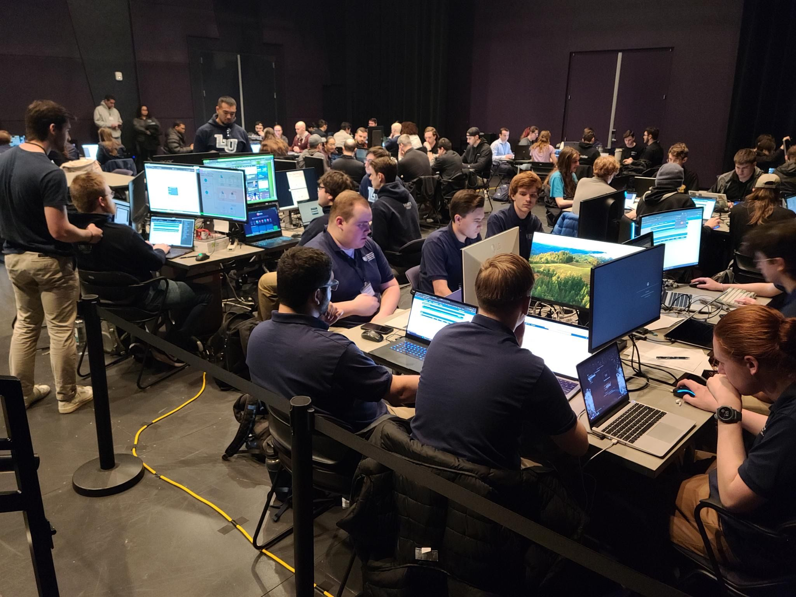
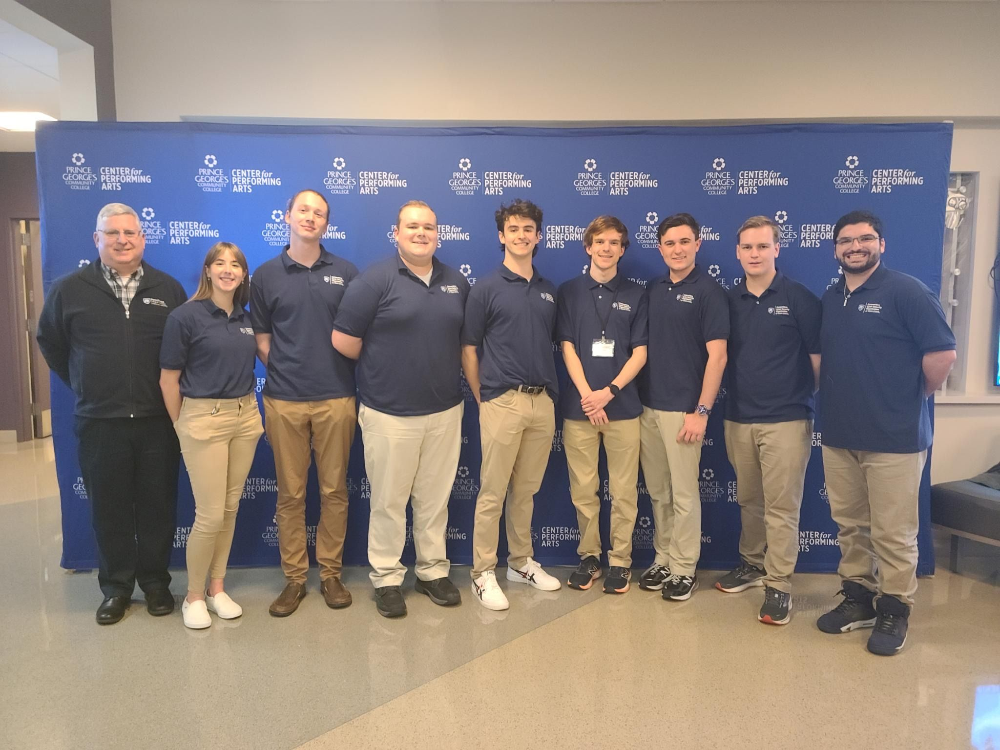

Last weekend, the Penn State Competitive Cyber Security Organization's (CCSO) defensive team took 2nd place out of 10 teams at the Mid-Atlantic Collegiate Cyber Defense Competition (MACCDC). It's the best finish Penn State has ever had at this event, and it came with a spot in the wildcard round for a shot at nationals.

## Our achievement

We placed 2nd out of 10 teams at MACCDC, a first for Penn State, and advanced to the wildcard competition where we fought for a spot in the national championships.

### Our team

- **Jacob Dorchinsky** (Captain)
- **Liam Geyer**
- **Brendan McShane**
- **Aiden Johnson**
- **Cy Fisher**
- **Jenna Fox**
- **Evan Glickman**
- **Maguire Younes**
- **Nick Giacobe** (Advisor)

### My role

I worked on firewalls and general network security: finding Command and Control (C2) servers, fixing improper sudo permissions, and cleaning up a long list of other security issues.

## Understanding MACCDC

MACCDC challenges teams to defend a simulated corporate network against a professional red team. The competition runs through qualifiers, a regional round, and then the wildcard round leading into national championships.

We got past qualifiers, then placed 2nd out of 10 at regionals, which pushed us into the wildcard round, where our run ended.

## Where we go from here

Getting knocked out at the wildcard round stings a little, but 2nd place at regionals is still the best MACCDC result Penn State has had. We picked up a lot of hands-on experience defending against real attacks, and we're already looking at what to fix before next season.
