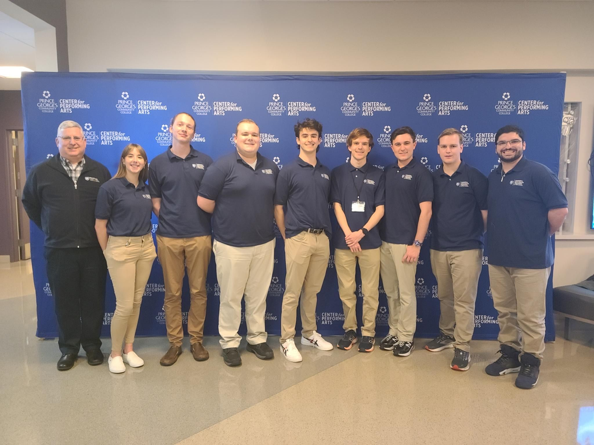

This post will cover our recent participation in the Mid-Atlantic Collegiate Cyber Defense Competition (MACCDC), where the PSU Competative Cyber Security Club's (CCSO) elite defensive cybersecurity team made history by securing 2nd place out of 10 teams. This is the first time PSU has achieved such a high rank, and we are immensely proud of our team's dedication and hard work.

## Our Achievement

### Breaking Records!

This past weekend, CCSO's elite defensive cybersecurity team took on the ultimate challenge at MACCDC. We clinched the 2nd position out of 10 teams, marking a historic milestone for our club. But it doesn't stop there…

Our team progressed to the wildcard competition, where we fiercely competed for a spot in the national championships.

### Our Team Members

Meet our dedicated team members who made this achievement possible:
- **Jacob Dorchinsky** (Captain)
- **Liam Geyer**
- **Brendan McShane**
- **Aiden Johnson**
- **Cy Fisher**
- **Jenna Fox**
- **Evan Glickman**
- **Maguire Younes**
- **Nick Giacobe** (Advisor)

### My Role

I contributed by working on the firewalls and general security, which included finding Command and Control (C2) servers, addressing improper sudo permissions, and resolving numerous other security issues.

## Understanding MACCDC

### Competition Structure

MACCDC is a prestigious cybersecurity competition that challenges teams to defend a simulated corporate network against a team of professional hackers (the Red Team). The competition consists of several phases, starting with the qualifiers, followed by regional competitions, and culminating in the wildcard round and national championships.

### Our Journey

We started by advancing past the qualifiers, which was a significant achievement in itself. Moving on, we excelled in the regional competition, securing 2nd place out of 10 teams a first for PSU! This success propelled us to the wildcard competition, where we competed fiercely but ultimately ended our journey.

## Reflection and Future Plans

The experience at MACCDC has been both challenging and rewarding. It has provided us with invaluable hands-on experience in defending against real-world cyber threats. Although our journey ended at the wildcard round, we are motivated by our achievements and the skills we've gained.

Stay tuned for more updates as we continue to hone our cybersecurity skills and prepare for future competitions!