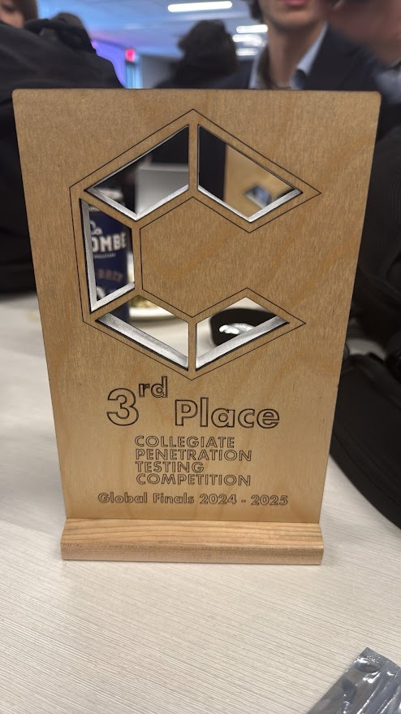
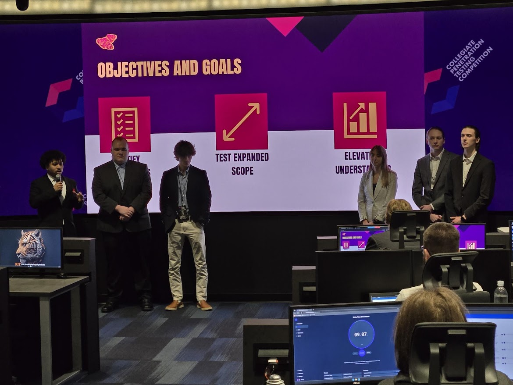

I was part of the Penn State Competitive Cyber Security Organization (CCSO) team that placed 3rd in the world at the Global Collegiate Penetration Testing Competition (CPTC). It's the highest placement in the history of Penn State's College of Information Sciences and Technology.

## The competition

Out of 62 teams globally and 545 participants, we made it to the Global Finals and also won the Best Presentation Award for how we communicated our findings. CPTC is a real-world penetration testing simulation: teams assess a company's security posture and report on it like they would for an actual client, and it pushes technical skill, creativity, and teamwork all at once.

## My role

I led:
- Web application penetration testing
- Database security
- Linux exploitation

Between hunting vulnerabilities, building exploits, and writing remediation guidance, the whole competition was intense in a good way. It reinforced how much team collaboration and clear reporting matter in this field, on top of the technical work.

## Teamwork makes the dream work

None of this happens without my teammates:

- **Jonathan Skeete**
- **Liam Geyer**
- **Jenna Fox**
- **Asa Reynolds**
- **Robert Roderick**

Huge thanks to our advisor, Nicklaus Giacobe, whose guidance carried us through the whole competition.

## Looking ahead

This result set a new bar for Penn State at CPTC, and I'm excited to see how far the program goes from here. Thanks to everyone who backed us on this one.

WE ARE!
