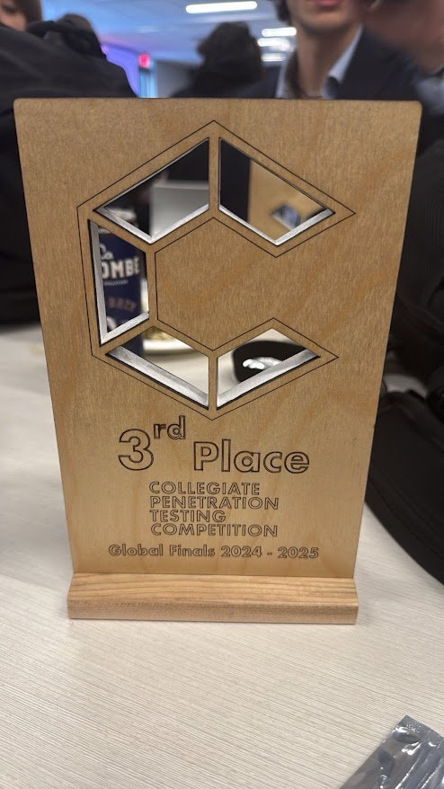

## A Historic Achievement

I'm incredibly proud to share that I was part of the Penn State Competitive Cyber Security Organization (CCSO) team that placed **3rd in the world** at the **Global Collegiate Penetration Testing Competition (CPTC)!** 🌍

This is the **highest placement in Penn State College of Information Sciences and Technology history**, and it's an honor to be part of such an incredible achievement.

## The Competition

Out of **62 teams globally (545 participants)**, we not only made it to the **Global Finals** but also earned the **Best Presentation Award**—a testament to our ability to communicate complex security findings effectively.

CPTC is not your average competition. It’s a real-world penetration testing simulation where teams assess and report on a company’s security posture. The challenge pushes technical skills, creativity, and teamwork to the limit.

## My Role

I had the privilege of serving as the main lead for:
- **Web Application Penetration Testing**
- **Database Security**
- **Linux Exploitation**

From hunting vulnerabilities to crafting exploits and developing remediation strategies, every moment of the competition was intense and rewarding. The experience reinforced the importance of **team collaboration, precise documentation, and effective reporting**—all essential skills in professional cybersecurity.

## Teamwork Makes the Dream Work

This achievement wouldn’t have been possible without the dedication and expertise of my amazing teammates:

- **Jonathan Skeete**
- **Liam Geyer**
- **Jenna Fox**
- **Asa Reynolds**
- **Robert Roderick**

And, of course, a huge thank you to our advisor **Nicklaus Giacobe**, whose guidance was instrumental throughout the competition.

## Looking Ahead

This experience has only fueled my passion for cybersecurity and penetration testing. As a team, we’ve set a new standard for Penn State, and I’m excited to see what the future holds!

Thank you to everyone who supported us on this journey. **Here’s to pushing boundaries, learning, and continuing to represent Penn State on the global stage!**

**WE ARE!** 🦁
