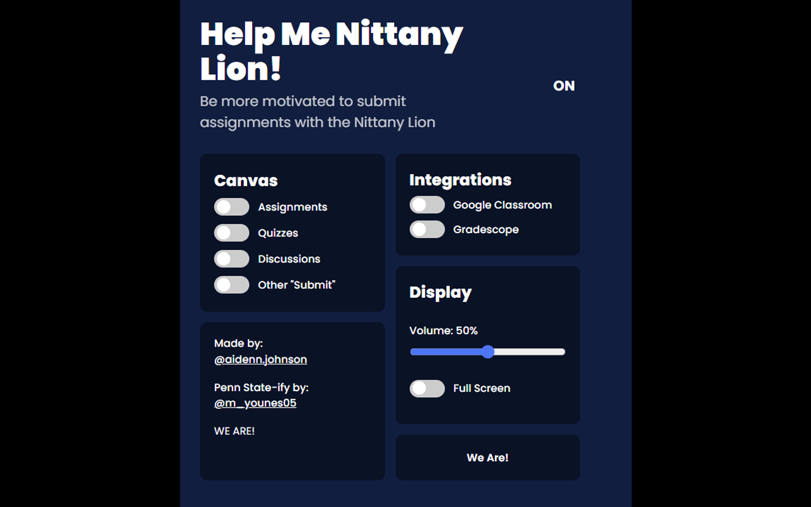
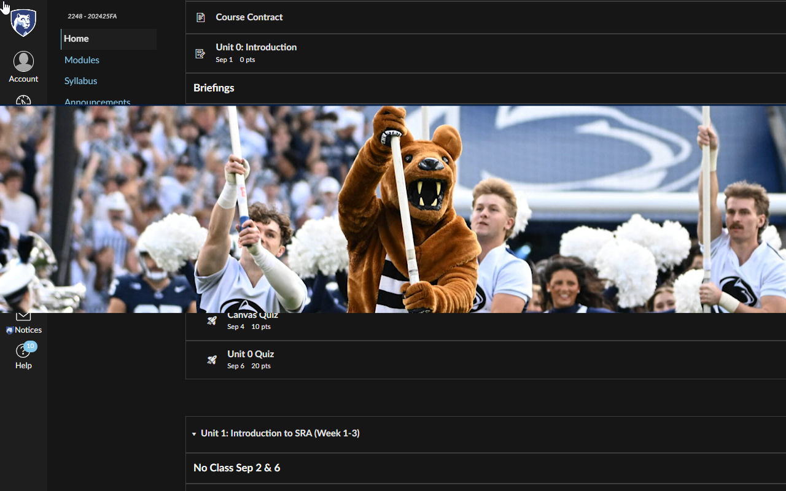

## The Inspiration

It all started when I stumbled upon a Chrome extension called "Help Me Bevo," which played the University of Texas mascot animation when submitting assignments. As a Penn State student, I thought, *why not bring this same energy to our own Canvas experience?* Thus, "Help Me Nittany Lion" was born!

## Learning the Ropes

At first, I had no idea how Chrome extensions worked. I cloned the "Help Me Bevo" repository and started dissecting the code. It was written in JavaScript and used event listeners to detect when an assignment was submitted. After a few hours of trial and error (and a lot of Googling), I got the custom PSU animation I made to trigger on Canvas submissions!

## Making It My Own

With the basics working, I started tweaking and adding new features:

- **Color:** I modified the extension to the color scheme of PSU so it fit more!
- **Quotes:** Every time the Extension settings page is opened, at the bottom, a custom PSU quote is listed such as "WE ARE!"
- **Animation:** Since there is no offical PSU annimation, I used some images and quotes to make it feel more like home.



## Publishing the Extension

Once I had a working version, it was time to navigate the maze of publishing on the Chrome Web Store. Google's verification process was more complicated than I expected, requiring a detailed privacy policy and permissions review. After a few revisions and approvals, "Help Me Nittany Lion" officially went live!

You can find it on the [Chrome Web Store](https://chromewebstore.google.com/detail/help-me-nittany-lion/ikkcnfblcfkcodnphdbhlepljidlohfh), and install it with just a click.



## Open Source 

"Help Me Nittany Lion" is open-source, meaning anyone can contribute or modify it to add their own school mascot. Check out the code on [GitHub](https://github.com/23younesm/Help-Me-Nittany-Lion) and feel free to fork it!

```html

```
Thanks to Aiden Johnson from UT for the source code and inspiration for this project!

```html

```

## Conclusion

What started as a simple idea turned into a fun, hands-on learning experience in Chrome extension development. If you’re a Penn State student, give it a try and let the Nittany Lion bring some school spirit to your assignments!

Check it out on the [Chrome Web Store](https://chromewebstore.google.com/detail/help-me-nittany-lion/ikkcnfblcfkcodnphdbhlepljidlohfh) and let me know what you think!

Happy submitting, and **WE ARE!** 🦁

