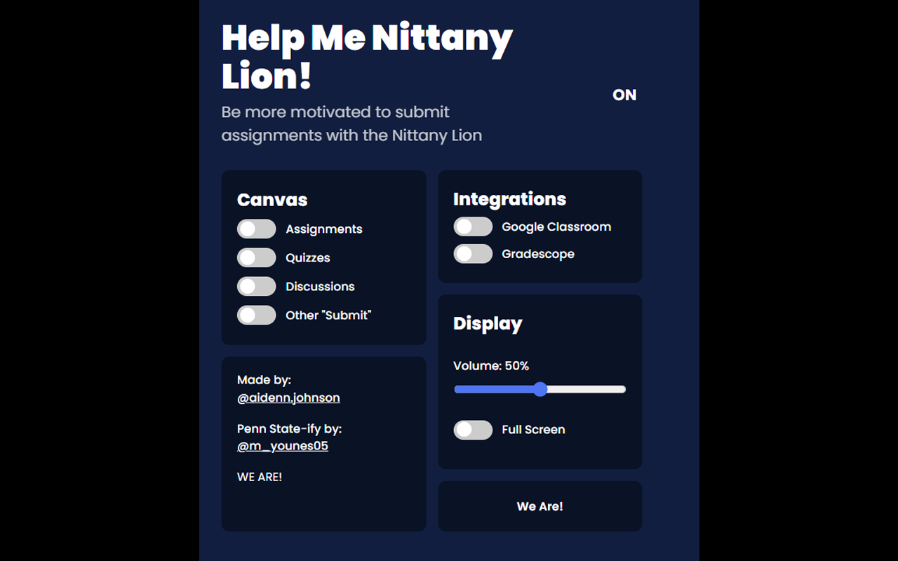
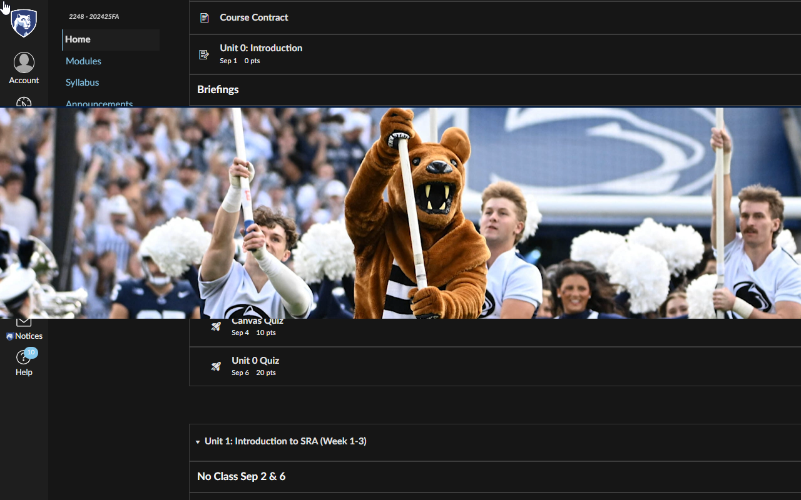

## The inspiration

I came across a Chrome extension called "Help Me Bevo" that plays the University of Texas mascot animation when you submit an assignment. As a Penn State student I couldn't let that stand, so "Help Me Nittany Lion" was born.

## Learning the ropes

I had zero experience with Chrome extensions going in. I cloned the "Help Me Bevo" repo and started picking apart the code, which was plain JavaScript using event listeners to catch assignment submissions. After a few hours of trial, error, and Googling, I had a custom PSU animation firing on Canvas submissions.

## Making it my own

Once the basics worked, I started adding my own touches:

- **Color:** switched the extension's palette to Penn State's colors so it actually felt like it belonged.
- **Quotes:** the extension's settings page now shows a random PSU quote at the bottom, like "WE ARE!"
- **Animation:** there's no official PSU animation to rip, so I pieced one together from images and quotes that feel like home.

## Publishing the extension

Getting it onto the Chrome Web Store took longer than I expected. Google's review process wanted a real privacy policy and a full permissions breakdown, and it took a few rounds of revisions before it got approved. Then "Help Me Nittany Lion" went live.

You can grab it on the [Chrome Web Store](https://chromewebstore.google.com/detail/help-me-nittany-lion/ikkcnfblcfkcodnphdbhlepljidlohfh) and install it in a click.

## Open source

The whole thing is open source, so anyone can fork it and swap in their own school's mascot. Code's on [GitHub](https://github.com/23younesm/Help-Me-Nittany-Lion).



Thanks to Aiden Johnson from UT for the original source and the idea.



What started as a way to kill an afternoon turned into a real crash course in Chrome extension development. If you're at Penn State, give it a shot.

Happy submitting, and WE ARE!
