This post shares the highlights of what I've been building over the summer expanding my Proxmox server capabilities, setting up a multi-node Kubernetes cluster with mini PCs, integrating robust monitoring and alerts, and optimizing my remote access workflows.

---

## Proxmox Server Upgrades

### Service Monitoring with Uptime Kuma 

I deployed [Uptime Kuma](https://github.com/louislam/uptime-kuma), a self-hosted monitoring tool that continuously checks my services and sends alerts with a custom **Signal API** bot that sends instant notifications to my phone via Signal messenger if anything goes offline.

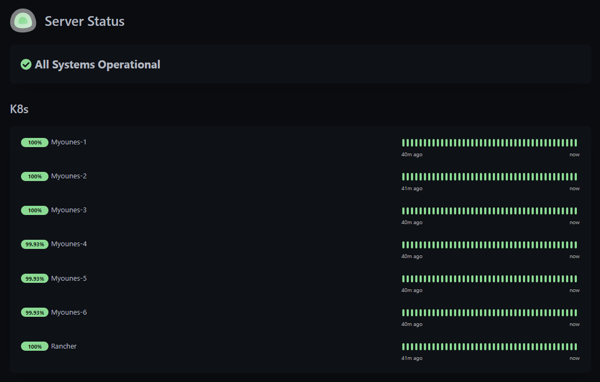
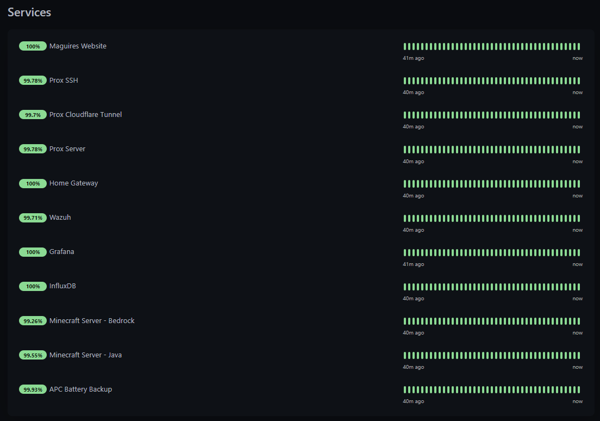
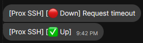
---

### File Upload Server with Pingvin Share

To simplify file transfers across my network and remotely, I deployed an upload server powered by [Pingvin Share](https://github.com/stonith404/pingvin-share). It supports drag-and-drop uploads and downloads via `wget`, making quick sharing easy without relying on third-party cloud storage. Uploads are password protected so only authorized users can upload.

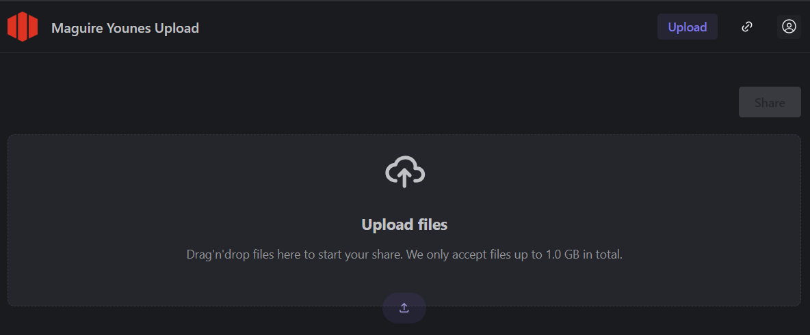

---

### Minecraft Servers: Java and Bedrock

Gaming is a key use case for my server. I run both **Minecraft Java Edition** and **Bedrock Edition** servers with plugins to enhance gameplay and administration. Using [playit.gg](https://playit.gg), I tunnel the servers securely without complicated port forwarding. This has been a really fun addition overall!

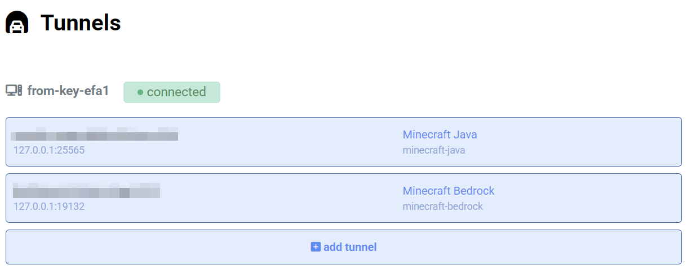

---

### Security Monitoring with Wazuh SIEM and Signal Alerts

Security is critical, so I deployed **Wazuh SIEM** across my network with agents on all key machines. Alerts are integrated with a custom **Signal API** bot that sends instant notifications to my phone via Signal messenger — offering secure, real-time incident awareness. My next steps are to use ansible to deploy Wazuh agents across my kubernetes cluster.

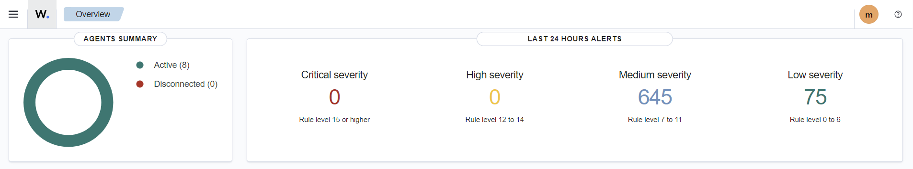  
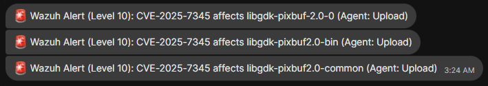

---

### Visualizing Server Performance with Grafana and InfluxDB

To monitor system health, I built dashboards using **Grafana** backed by **InfluxDB**, tracking CPU, memory, disk, and network metrics across my servers and VMs in real time. I coded a custom scraper to snag the power API data from my ILO and then import it into my Granfana instance so I can monitor it as well!

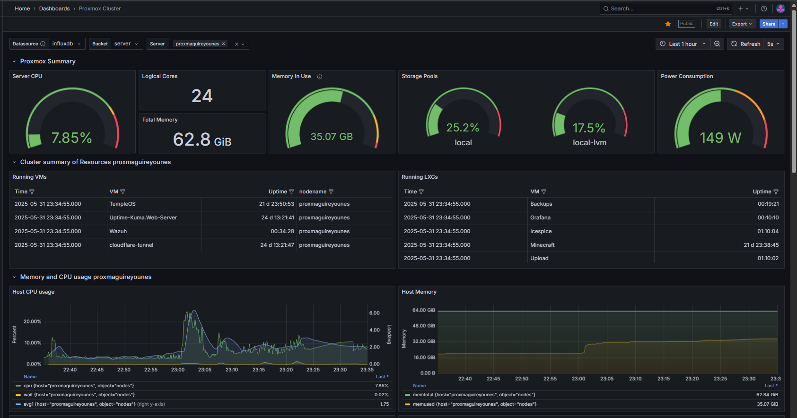

---

## Gaming PC Remote Access with Parsec

Instead of moving my gaming PC between home and Penn State, I use **Parsec** for low-latency remote desktop streaming. This lets me game smoothly from anywhere without hauling hardware. This has been really successful and easy to use, I highly suggest it to all even for non-gaming purposes such as video editing.

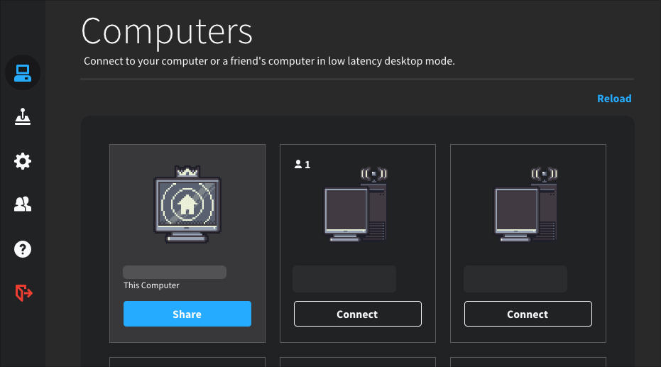

---

## Kubernetes Cluster with Mini PCs

This summer, I acquired 10 mini PCs and built a Kubernetes cluster with:

- 3 master nodes  
- 7 worker nodes  

Using **Kubespray** and **Ansible**, I deployed Kubernetes and wrote custom playbooks to install **Helm** and management tools like **Rancher**. This cluster is my playground for learning cloud-native orchestration, and I plan to add **Ceph** distributed storage soon. Overall the cluster has 68 GiB of RAM and 54 cores of CPU power.

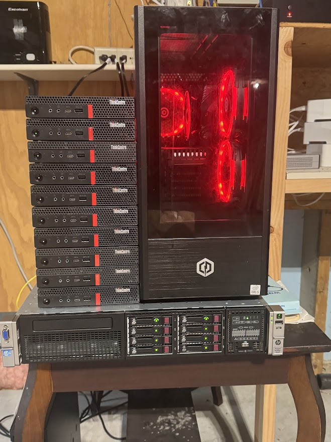
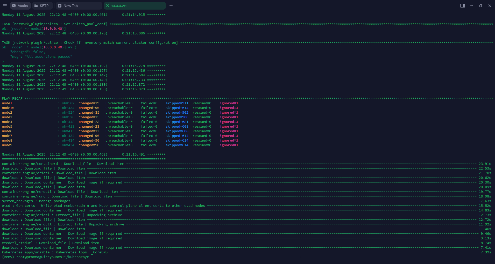
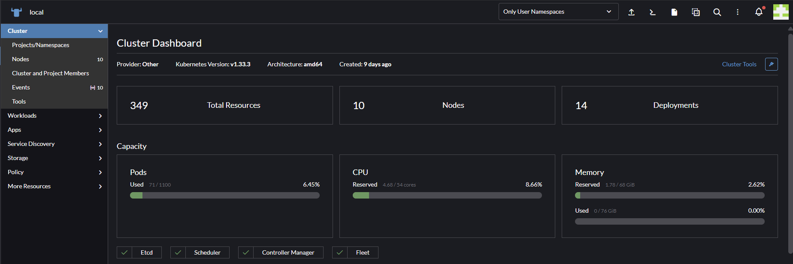

---

## Reliable Power Backup with APC UPS

To protect against frequent power blips common in Pennsylvania, my entire compute setup is backed by an **APC UPS** that provides over 5 minutes of runtime. This prevents unexpected shutdowns and data loss. This has been a great addition and lets me remotly power cycle my compute center with proper groups. My next goals with the APC is to set up SNMP traps to alert me when there is a power outage and when the battery lowers below 10%. More to come with this!

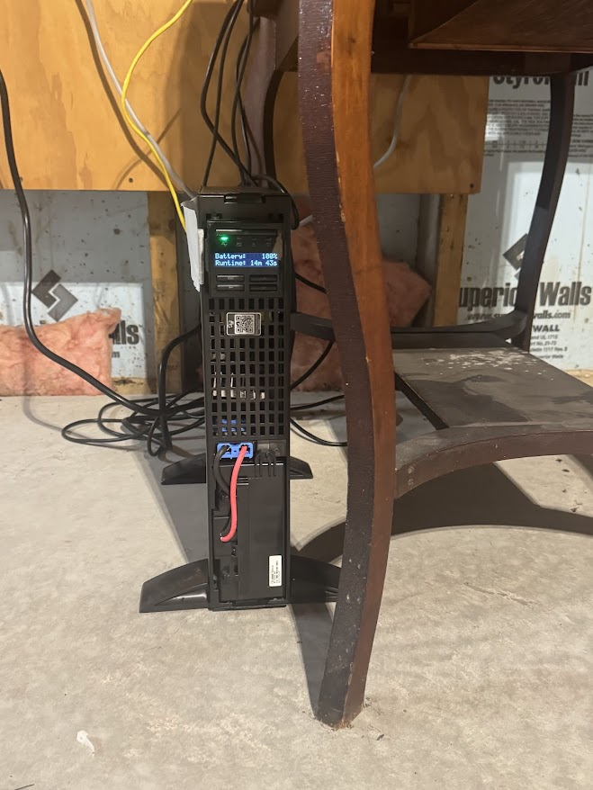

---

## Conclusion

This summer’s projects have been an incredible learning investment. From enhancing my Proxmox environment to orchestrating Kubernetes and building out monitoring and security automation, the journey has been both challenging and rewarding.

I’m excited to keep sharing insights and expanding this lab in the months ahead!

---

*If you'd like to see detailed configs, playbooks, or walkthroughs of any part, feel free to reach out!*

---

© 2025 Maguire Younes  
