This summer I expanded my Proxmox setup, built a multi-node Kubernetes cluster out of mini PCs, added real monitoring and alerting, and cleaned up my remote access workflow. Here's what changed.

---

## Proxmox server upgrades

### Service monitoring with Uptime Kuma

[Uptime Kuma](https://github.com/louislam/uptime-kuma) now watches all my services and pings a custom Signal API bot the moment something goes offline, straight to my phone.

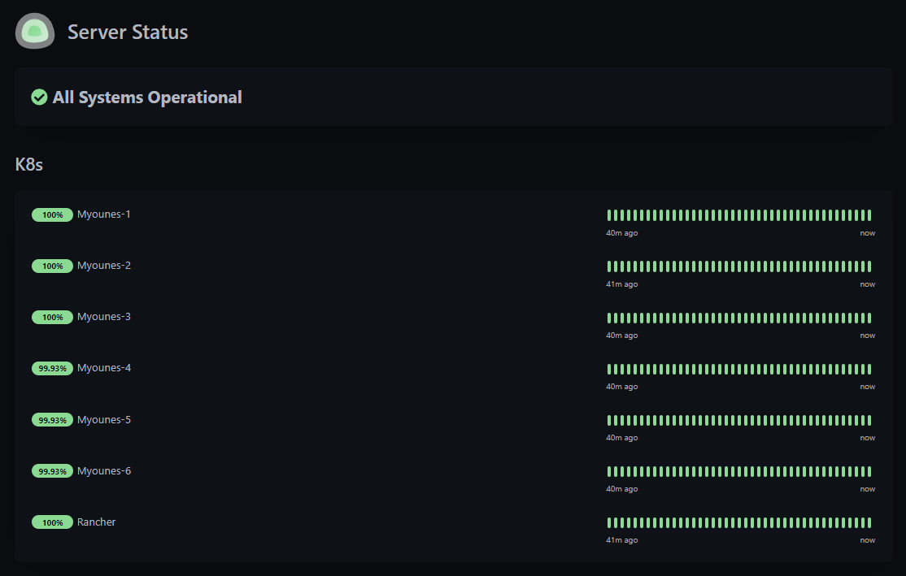
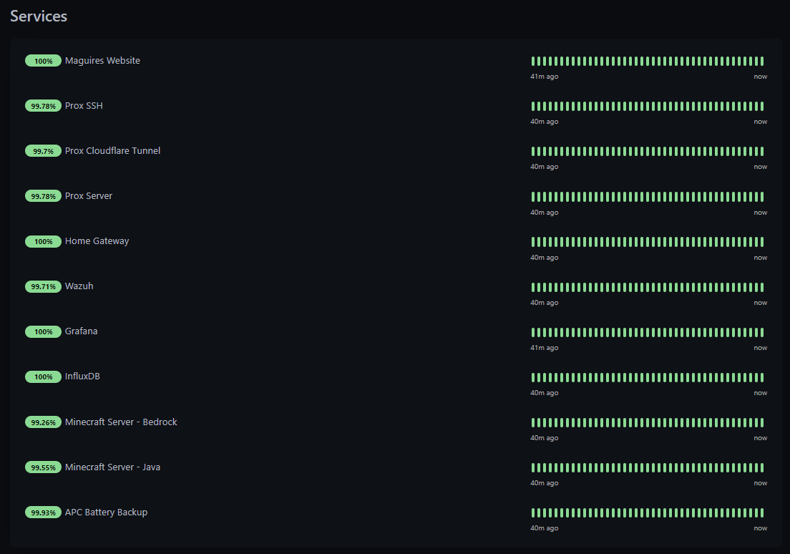
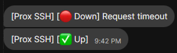

---

### File upload server with Pingvin Share

For quick file transfers across my network and remotely, I stood up [Pingvin Share](https://github.com/stonith404/pingvin-share). Drag-and-drop uploads, `wget` downloads, no dependence on someone else's cloud. Uploads are password protected so only people I've given access to can push files.

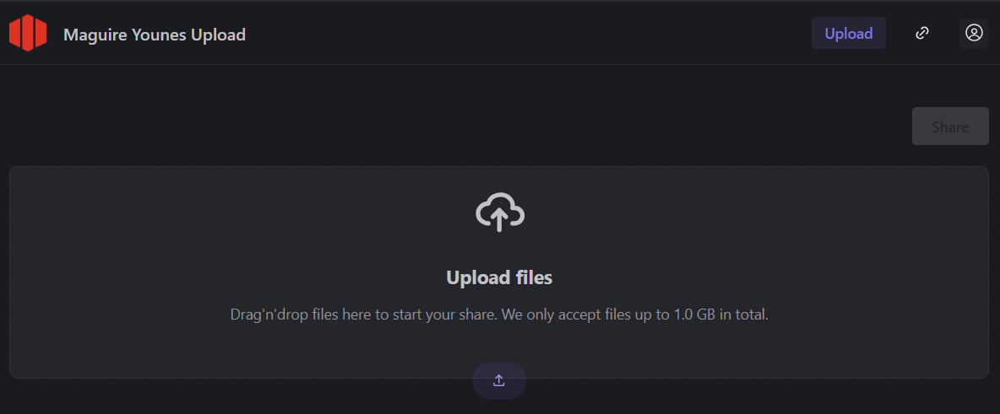

---

### Minecraft servers: Java and Bedrock

Gaming is a real use case for this hardware. I run both Java and Bedrock Minecraft servers with plugins for gameplay and admin, tunneled through [playit.gg](https://playit.gg) so I skip the port forwarding headache entirely. This has turned out to be one of the more fun parts of the whole setup.

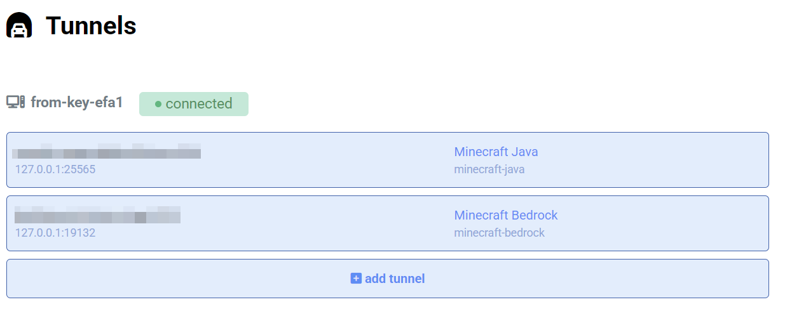

---

### Security monitoring with Wazuh SIEM and Signal alerts

Wazuh SIEM now runs across the network with agents on every key machine, and alerts feed into the same Signal bot for real-time incident awareness. Next step here is deploying Wazuh agents across the Kubernetes cluster with Ansible.

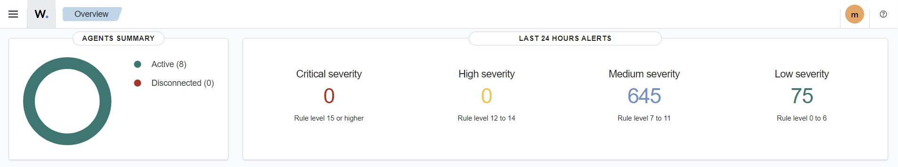
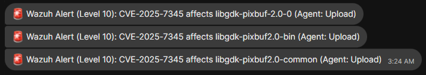

---

### Visualizing server performance with Grafana and InfluxDB

Grafana dashboards backed by InfluxDB track CPU, memory, disk, and network across all my servers and VMs in real time. I also wrote a custom scraper that pulls power data from my ILO and feeds it into Grafana too.

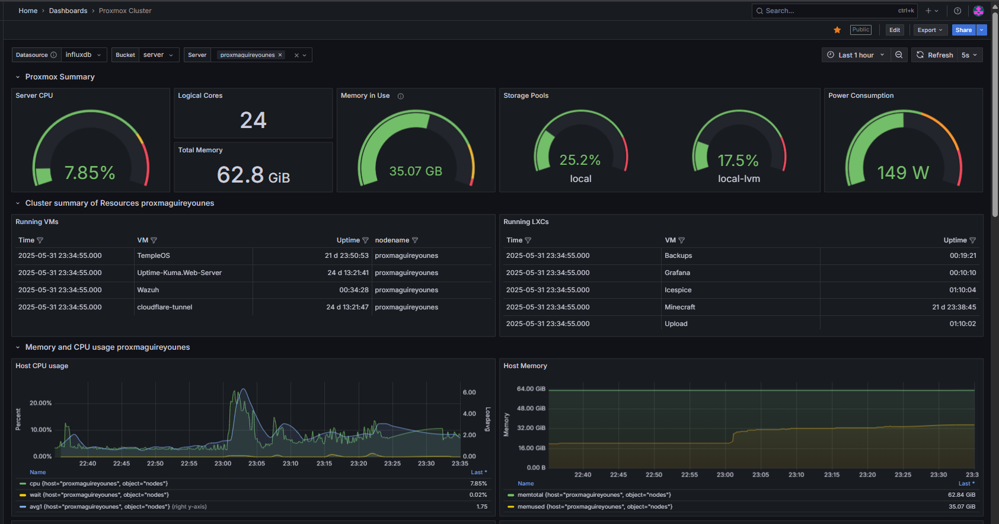

---

## Gaming PC remote access with Parsec

Instead of hauling my gaming PC between home and Penn State, I use Parsec for low-latency remote desktop streaming. It's worked well enough that I'd recommend it even for non-gaming use, like video editing.

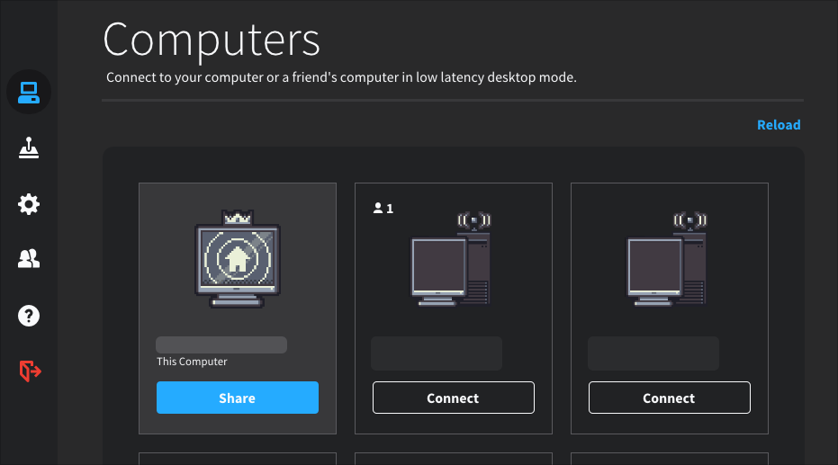

---

## Kubernetes cluster with mini PCs

I picked up 10 mini PCs and built a cluster:

- 3 master nodes
- 7 worker nodes

Kubespray and Ansible handled the Kubernetes deployment, and I wrote custom playbooks to install Helm and Rancher for management. The cluster runs 68 GiB of RAM and 54 cores total, and it's become my playground for learning cloud-native orchestration. Ceph distributed storage is next on the list.

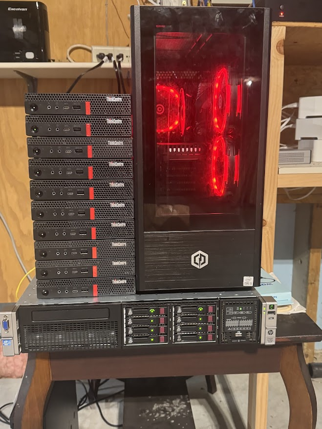
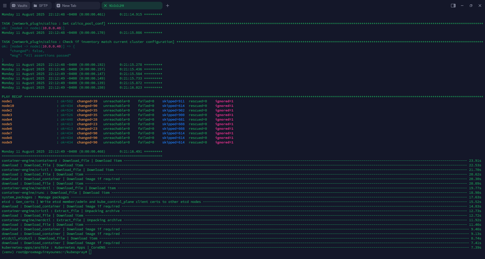
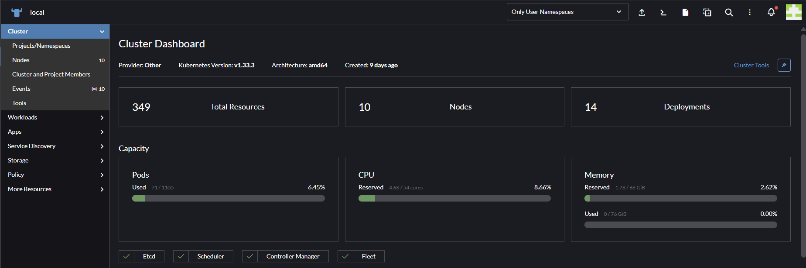

---

## Reliable power backup with APC UPS

Pennsylvania gets frequent power blips, so the whole compute setup now sits behind an APC UPS with over 5 minutes of runtime. It also lets me remotely power cycle machines in proper groups, which has already been useful. Next up: SNMP traps to alert me on outages and when the battery drops below 10%.

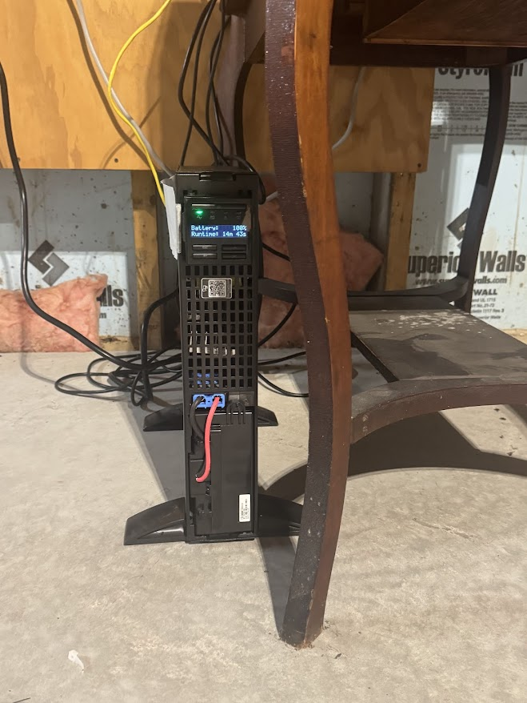

---

This summer's projects took a lot of late nights, but I came out with a much more capable lab: a stronger Proxmox environment, a real Kubernetes cluster, and monitoring and security automation that actually tells me when something's wrong instead of finding out the hard way. More to come as I keep expanding it.

---

*Want configs, playbooks, or a walkthrough of any part of this? Reach out.*

---

© 2025 Maguire Younes
