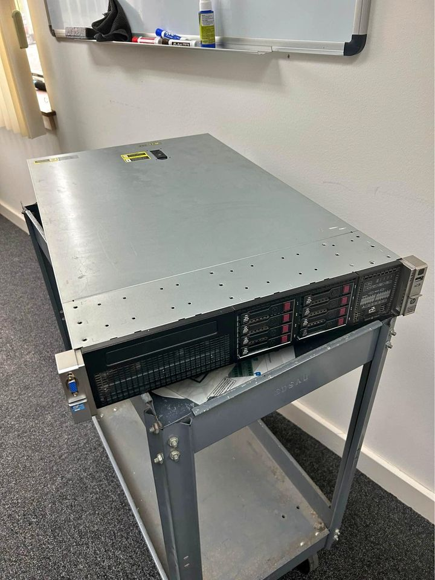
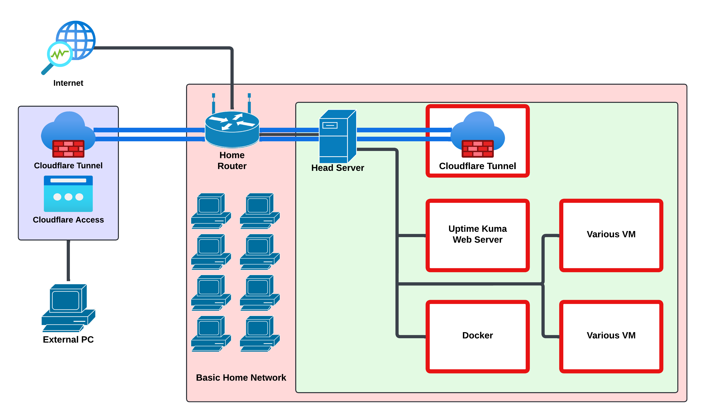

Here's how I turned an old HP ProLiant DL380p into a Proxmox virtualization box for remote access, monitoring, and container hosting.

## Background

I picked up an HP ProLiant DL380p off Facebook Marketplace. Specs:

- 2x Intel Xeon E5-2640 0 @ 2.50GHz
- 64 GB DDR3 RAM
- HP Ethernet 1Gb 4-port 331FLR adapter
- 2.2 TB RAID 1 storage

It came off Windows Server 2012 running Hyper-V VMs. I switched to Proxmox for the Linux base and the stronger virtualization features.

## Initial setup challenges

### Firmware update

Booting the Proxmox installer off USB didn't work at first because the server's firmware was too old. HP's own USB ISO for firmware updates was itself too outdated to run, so I ended up going through the Integrated Lights-Out (ILO) interface instead.

### Learning ILO

ILO took some real research to get comfortable with, but I got the firmware updated through it eventually. Surprisingly, HP still supports firmware updates for a server this old.

### Installing Proxmox

With firmware sorted, I used ILO's virtual DVD feature to mount the Proxmox installer, installed it, and formatted the disks the way I wanted.

## Configuring Proxmox and VMs

### Initial VM setup

First VM up was a basic Red Hat Linux box running a Cloudflare tunnel, which lets me reach my private network securely from Penn State without touching port forwarding.

### Monitoring and security

Uptime Kuma runs on the server now, giving me a dashboard for my website, the server itself, the tunnel, and SSH access.



I also added fail2ban on every VM with SSH exposed and locked down Proxmox permissions to cut off unauthorized access.



### Container management

[Portainer](https://www.portainer.io/) handles Docker container management, including spinning up things like my [Signal API bot](https://maguireyounes.com/posts/signal-api).

## Future plans

With Proxmox where I want it, next up is using it to practice red and blue team skills, starting with an upcoming Red vs Blue exercise. I also want to learn [Ansible](https://www.ansible.com/) for VM deployments and get [Wazuh SIEM](https://wazuh.com/) running for threat monitoring.

Turning an old rack server into something this useful has been one of the more satisfying projects I've done. If you're doing something similar, feel free to steal any part of this setup.
