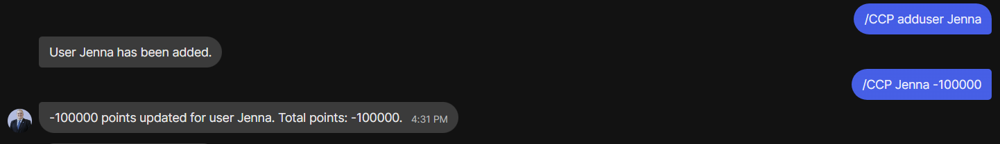
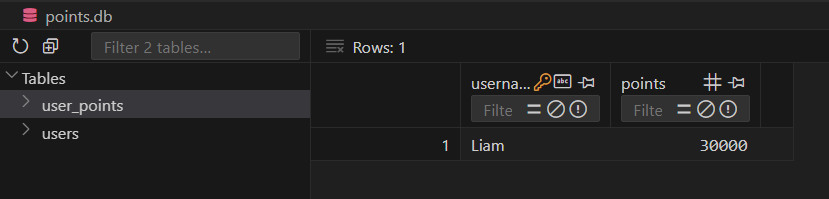

This post covers my experience creating a Python script to interact with my friends' Signal group chat. The script listens for commands related to our inside joke about the [Chinese Communist Party Social Credit System](https://www.businessinsider.com/china-social-credit-system-punishments-and-rewards-explained-2018-4) and responds accordingly. The Signal API GitHub repo was instrumental in setting this up.

## Background

To make our group chat more engaging, we came up with a joke CCP social credit system where we assign points based on various actions. I decided to automate this process using a Python script that listens for commands and updates points accordingly.



## Setting Up the Environment

First, I set up the necessary environment to interact with the Signal API. This involved configuring the API endpoints and ensuring proper communication with the Signal server. I was able to accomplish this by using an unofficial signal-cli-rest-api.



### Sending and Receiving Messages

The script includes functions to send and receive messages via the Signal API. The `send_message` function is responsible for sending messages to the group, and the `receive_messages` function listens for new messages.

### Parsing and Processing Commands

The script parses commands related to the CCP social credit system and processes them accordingly. Commands include adding users, listing all users, updating points, and more. This ensures the script can respond appropriately to various interactions in the chat. The script only accepts commands from selected users to make sure it cant be tampered with.

### Parsing Commands

The `parse_command` function identifies commands from the chat messages. Here are some examples of the commands it can parse:

- **Adding a User**: `/CCP adduser <username>`
    ```python
    if text.startswith("/CCP adduser"):
        parts = text.split()
        if len(parts) == 3:
            command, action, user = parts
            if action == "adduser":
                return {"action": "adduser", "user": user}
    ```

- **Listing All Users**: `/CCP listall`
    ```python
    elif text.startswith("/CCP listall"):
        return {"action": "listall"}
    ```

- **Updating Points**: `/CCP <username> <points>`
    ```python
    elif text.startswith("/CCP"):
        parts = text.split()
        if len(parts) == 3:
            command, user, points_str = parts
            try:
                points = int(points_str)
                return {"action": "update_points", "user": user, "points": points}
            except ValueError:
                return {"error": "Invalid points value"}
    ```

### Processing Commands

The `process_command` function executes actions based on parsed commands. Here are some examples of the actions it can perform:

- **Adding a User**:
    ```python
    if action == "adduser":
        user = command_data.get("user")
        result = add_user_to_database(user)
        return f"User {user} has been added." if result else f"Failed to add user {user}. It may already exist."
    ```

- **Listing All Users**:
    ```python
    elif action == "listall":
        return list_users_and_scores()
    ```

- **Updating Points**:
    ```python
    elif action == "update_points":
        user = command_data.get("user")
        points = command_data.get("points")
        if points is not None:
            success, total_points = update_user_points(user, points)
            return f"{points} points updated for user {user}. Total points: {total_points}." if success else f"Failed to update points for user {user}."
        else:
            return "Error: Invalid points value."
    ```

These functions ensure that the script can correctly interpret and act upon the various commands issued in the group chat, making the "CCP" social credit system interactive and fun for everyone involved.

### Database Management

I used SQLite to manage user data and their points. This involved creating and maintaining tables for users and their corresponding points, ensuring data persistence and easy retrieval.



### Adding and Updating Users

The script handles adding new users and updating their points in the database. The `add_user_to_database` function inserts a new user, and the `update_user_points` function adjusts the points for an existing user.

### Listing Users and Scores

The script retrieves and displays the list of users and their corresponding scores. The `list_users_and_scores` function queries the database and formats the results into a readable format.

## Running the Script

The script runs in a continuous loop on my [Proxmox Server](https://maguireyounes.com/posts/server), checking for new messages and processing commands. It listens for messages, parses commands, and executes the necessary actions, providing real-time interaction within the group chat.


## Conclusion

Creating this Python script to automate interactions in our Signal group chat has added a fun twist to our conversations. The joke CCP social credit system now runs smoothly, making our chats more engaging and entertaining. Feel free to use and customize the script for your own group chat automations. Full code can be found at my repo below!



Happy coding!
