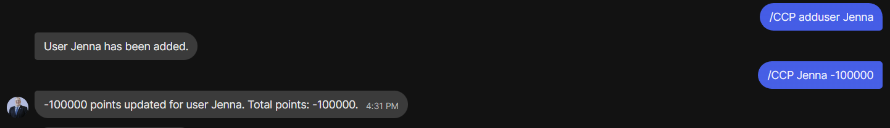
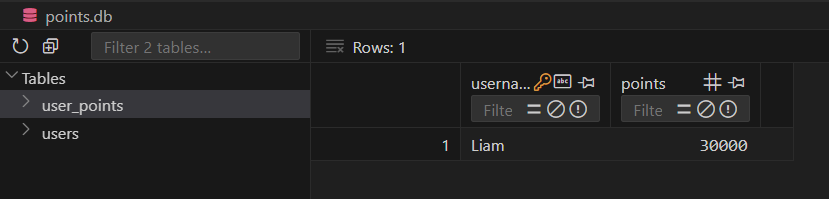

My friends and I have an inside joke about a Chinese Communist Party-style [social credit system](https://www.businessinsider.com/china-social-credit-system-punishments-and-rewards-explained-2018-4) we run in our Signal group chat, and I got tired of tracking it by hand. So I wrote a Python script that listens for commands in the chat and updates everyone's score automatically. The Signal API GitHub repo did most of the heavy lifting for getting this working.

## Background

We assign points to each other based on dumb stuff people do in the group chat, and I automated the bookkeeping with a script that listens for commands and updates scores.



## Setting up the environment

Getting the environment talking to the Signal API meant standing up an unofficial signal-cli-rest-api and wiring up the endpoints.



### Sending and receiving messages

`send_message` sends messages to the group, and `receive_messages` listens for new ones coming in.

### Parsing and processing commands

The script parses commands for the CCP social credit system: adding users, listing users, updating points, that kind of thing. It only accepts commands from a set list of users so nobody can mess with the scores who shouldn't be able to.

### Parsing commands

`parse_command` pulls commands out of chat messages. A few examples:

- **Adding a user**: `/CCP adduser <username>`
    ```python
    if text.startswith("/CCP adduser"):
        parts = text.split()
        if len(parts) == 3:
            command, action, user = parts
            if action == "adduser":
                return {"action": "adduser", "user": user}
    ```

- **Listing all users**: `/CCP listall`
    ```python
    elif text.startswith("/CCP listall"):
        return {"action": "listall"}
    ```

- **Updating points**: `/CCP <username> <points>`
    ```python
    elif text.startswith("/CCP"):
        parts = text.split()
        if len(parts) == 3:
            command, user, points_str = parts
            try:
                points = int(points_str)
                return {"action": "update_points", "user": user, "points": points}
            except ValueError:
                return {"error": "Invalid points value"}
    ```

### Processing commands

`process_command` runs the actual action once a command is parsed:

- **Adding a user**:
    ```python
    if action == "adduser":
        user = command_data.get("user")
        result = add_user_to_database(user)
        return f"User {user} has been added." if result else f"Failed to add user {user}. It may already exist."
    ```

- **Listing all users**:
    ```python
    elif action == "listall":
        return list_users_and_scores()
    ```

- **Updating points**:
    ```python
    elif action == "update_points":
        user = command_data.get("user")
        points = command_data.get("points")
        if points is not None:
            success, total_points = update_user_points(user, points)
            return f"{points} points updated for user {user}. Total points: {total_points}." if success else f"Failed to update points for user {user}."
        else:
            return "Error: Invalid points value."
    ```

Between these, the script can interpret and act on whatever comes through the chat.

### Database management

Points and users live in SQLite, with tables for both so nothing gets lost between restarts.



### Adding and updating users

`add_user_to_database` inserts new users, and `update_user_points` adjusts scores for existing ones.

### Listing users and scores

`list_users_and_scores` queries the database and formats it into something readable in chat.

## Running the script

The script runs in a loop on my [Proxmox server](https://maguireyounes.com/posts/server), watching for new messages and reacting to commands in real time.

The joke social credit system now runs itself, which somehow makes it funnier than when we tracked it by hand. Full code's below if you want to steal it for your own group chat.


